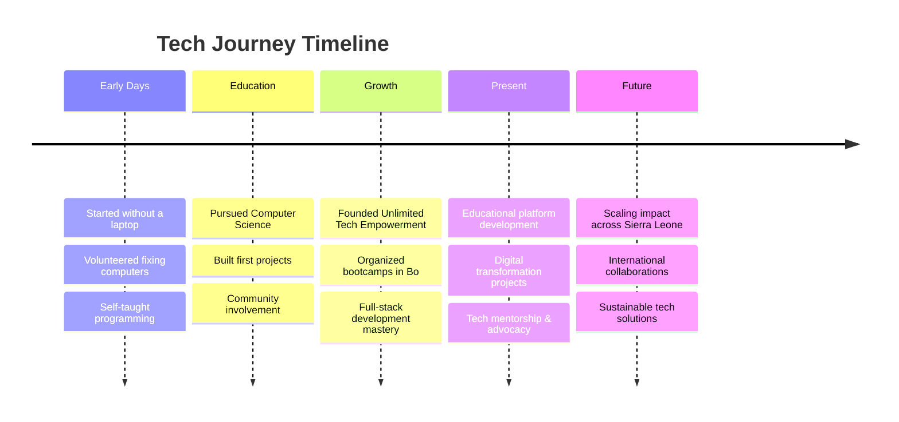

#  Hello World, I'm Titus Jusu Nabieu

<div align="center">
  
[](https://git.io/typing-svg)

</div>

<div align="center">
  
  
</div>

---

## 🚀 About Me

> 🎓 **Computer Science Graduate** turned **Social Impact Technologist**  
> 💡 From fixing computers without a laptop to building platforms that serve thousands  
> 🌍 **Founder of Unlimited Tech Empowerment** - Making tech accessible across Sierra Leone

```javascript
const titus = {
    location: "Sierra Leone 🇸🇱",
    education: "BSc Computer Science",
    mission: "Using technology for social good",
    currentFocus: [
        "Educational Management Platforms",
        "Digital Transformation Projects", 
        "Youth Tech Empowerment",
        "Open Source Collaboration"
    ],
    funFact: "Started my journey by volunteering to fix computers 💻"
};
```

---

## 🛠️ Tech Arsenal

<div align="center">

### Frontend Mastery


### Backend Power  


### Tools & Platforms


</div>

<details>
<summary>📊 <b>Detailed Tech Stack</b></summary>

| Category | Technologies |
|----------|-------------|
| **Frontend** |     |
| **Backend** |     |
| **Mobile** |  |
| **Database** |   |
| **DevOps** |   |
| **UI/UX** |    |

</details>

---

## 🎯 Current Mission

<div align="center">
  
### 🎓 Educational Transformation
Building **admission and document management platforms** that streamline processes for educational institutions across West Africa

### 🌍 Digital Inclusion
Organizing community **bootcamps** and **tech workshops** in underserved areas, most notably in **Bo, Sierra Leone**

### 💡 Innovation & Leadership  
Exploring **NGO/donor-funded digital transformation** projects to create sustainable impact

</div>

---

## 🏆 Impact & Achievements

<div align="center">

| 🎯 **Community Impact** | 📈 **Technical Growth** | 🌟 **Leadership** |
|:---:|:---:|:---:|
| Founded **Unlimited Tech Empowerment** | Self-taught full-stack development | Organized multiple tech bootcamps |
| Bridging digital divide in Sierra Leone | Built platforms serving thousands | Mentoring aspiring developers |
| Tech inclusion advocacy | Open source contributions | Youth empowerment initiatives |

</div>

---

## 📈 GitHub Analytics

<div align="center">
  
</div>

<div align="center">
  
</div>

---

## 🌟 My Journey

<div align="center">



</div>

---

## 💬 Let's Connect & Collaborate

<div align="center">

[](mailto:nabieutitusjusu@gmail.com)
[](https://www.linkedin.com/in/titusnabieu)
[](https://twitter.com/titusjusu)
[](#)

</div>

---

<div align="center">

### 💭 Philosophy

> *"Access to technology shouldn't be a privilege. That's why I teach, build, and share — to spark the flame in others like someone once did for me."*

**🔥 Ready to make an impact together? Let's build something amazing!**

</div>

---

<div align="center">
  


**⭐ Don't forget to star my repositories if you find them helpful!**

</div>

---

```bash
# Clone my journey
git clone https://github.com/TitusJusuNabieu
cd social-impact-through-tech
npm install compassion empathy dedication
npm start building-the-future
```

<div align="center">
  
</div>
